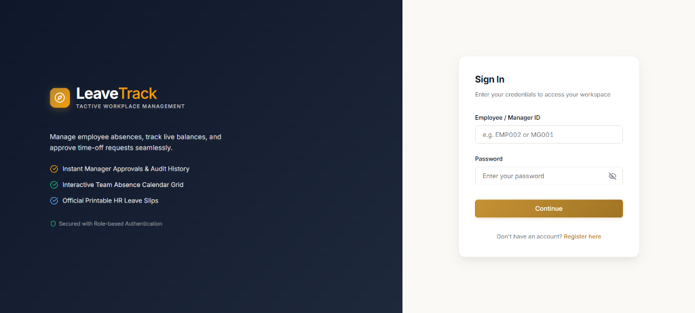
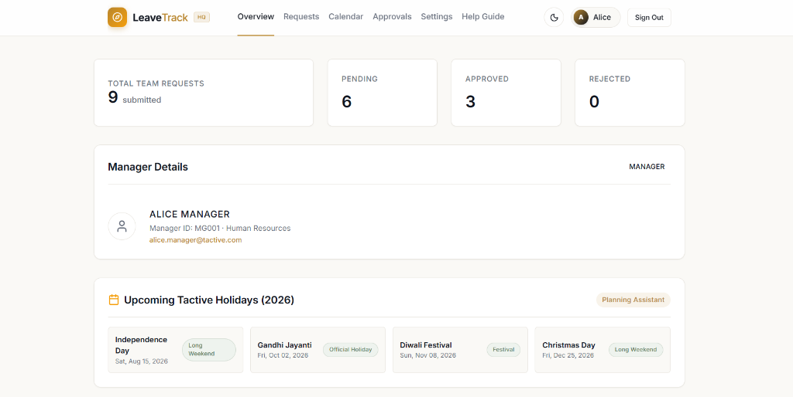
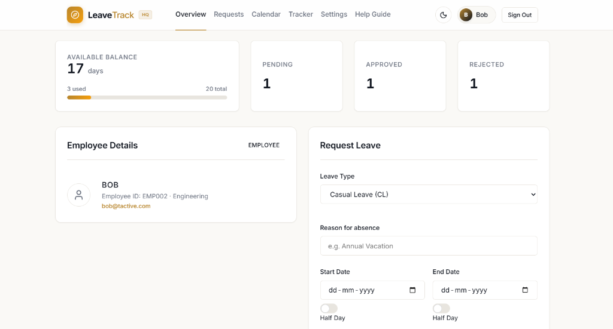
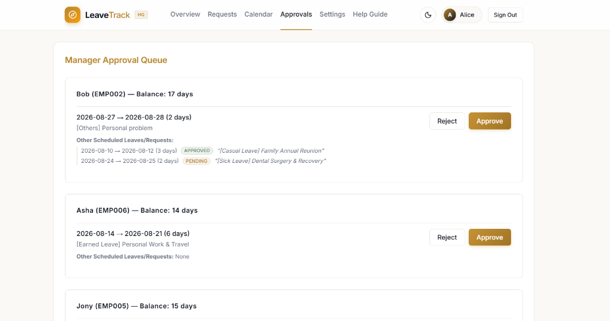
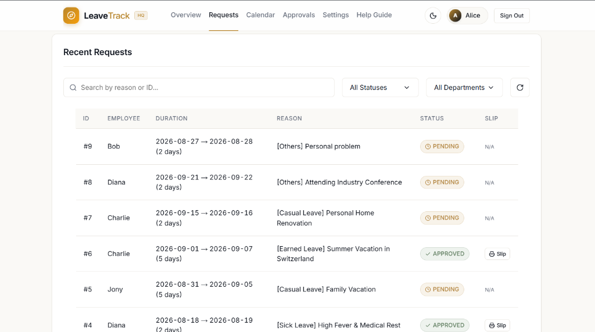
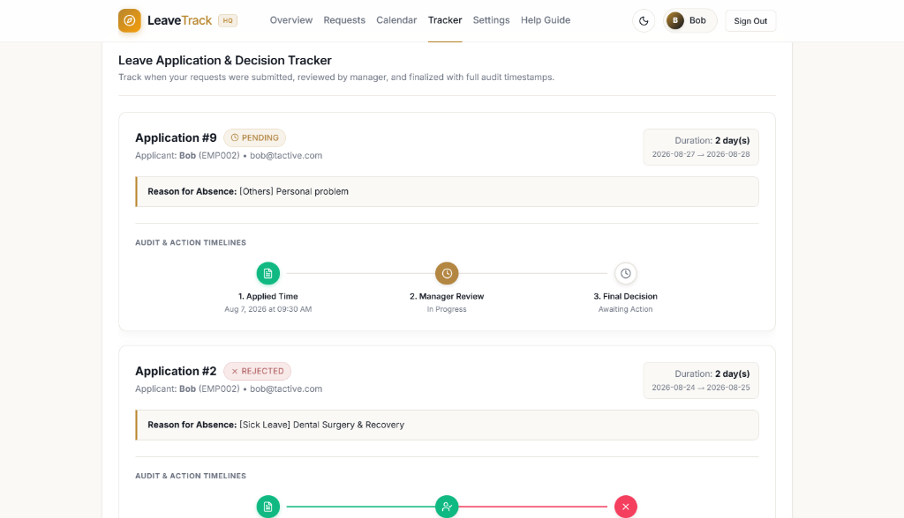

# 🏥 LeaveTrack — Enterprise Workplace Leave Management System

[](https://www.python.org/)
[](https://flask.palletsprojects.com/)
[](https://www.sqlite.org/)
[](https://docs.pytest.org/)
[](https://leavetrack-10ut.onrender.com)


## 🌟 Executive Summary

**LeaveTrack** is an enterprise workplace leave management application engineered to solve critical absence scheduling challenges in modern corporate teams. Built with a Python Flask REST API, SQLite 3 persistent storage, and a responsive Single-Page Application (SPA) interface, LeaveTrack eliminates manual spreadsheet tracking errors, prevents overlapping employee absences, and enforces automated business logic rules.

---

## ✨ Key Technical & Business Innovations

* **Automated Weekend Holiday Exclusion (Rule 13)**:  
  Saturdays (`weekday 5`) and Sundays (`weekday 6`) are automatically skipped from leave consumption calculations. A leave requested from Friday to Monday (4 calendar days) deducts **only 2 working days** from the employee's balance.
* **Role-Based Access Control (RBAC)**:  
  Distinct scoped workflows for **Employees** (request submission, balance tracking, HR slip printing) and **Managers** (department queue approval/rejection, team KPI metrics).
* **Role-Adaptive KPI Dashboard**:  
  Dynamically adapts dashboard metrics based on active user role. Employees see **AVAILABLE BALANCE** (`20.0 days`), while Managers see **TOTAL TEAM REQUESTS** across departments.
* **Half-Day Duration Calculations**:  
  Supports 0.5-unit leaves on start and end dates with exact mathematical balance validation.
* **Official Printable HR Verification Slips**:  
  Generates one-click printable leave verification slips complete with approval badges, security tokens, and reference numbers.
* **Theme System & Accessibility**:  
  Glassmorphism UI supporting Dark & Light modes with theme-adaptive gold datepicker indicators (`::-webkit-calendar-picker-indicator`).

---

## 🛠️ Technology Stack Rationale

| Component | Technology | Technical Rationale |
|-----------|------------|---------------------|
| **Backend API** | Python 3.11 / Flask 3.0 | High-performance RESTful API endpoints with lightweight WSGI routing and structured error handlers. |
| **Database** | SQLite 3 | Embedded zero-configuration ACID database configured with `DATABASE_PATH` for permanent cloud persistence on Render. |
| **Frontend UI** | Vanilla HTML5 / CSS3 / ES6 JS | Zero external JavaScript framework overhead; delivers sub-100ms UI page switches, touch scrolling, and clean DOM manipulation. |
| **QA Automation** | Pytest 7.4 | Suite executing 20 automated integration test cases in ~1 second. |
| **WSGI Host** | Gunicorn WSGI | Production process manager powering live Render cloud deployment. |

---

## 📡 REST API Endpoint Specifications

| Endpoint | Method | Headers | Description |
|----------|--------|---------|-------------|
| `/employees/<id>` | `GET` | — | Returns employee profile, role, and current leave balance. |
| `/employees` | `POST` | — | Registers a new employee or manager account (`{name, role}`). |
| `/leaves` | `GET` | — | Fetches all leave requests with employee details and status. |
| `/leaves` | `POST` | — | Submits a new leave request (`{employee_id, start_date, end_date, reason}`). |
| `/leaves/<id>/approve` | `POST` | `Manager-Id` | Approves pending request and updates employee status. |
| `/leaves/<id>/reject` | `POST` | `Manager-Id` | Rejects pending request and restores deducted balance. |

---

## 🚀 Quick Start Guide (Local Setup & Run)

### 1. Clone Repository & Install Dependencies:
```bash
git clone https://github.com/Neha-0019/LeaveTrack.git
cd LeaveTrack
pip install -r requirements.txt
```

### 2. Run Local Development Server:
```bash
python app.py
```
Open **`http://127.0.0.1:5000`** in your browser.

### 3. Run Automated QA Test Suite:
```bash
python -m pytest test_leave_workflow.py -v
```

---

## 📸 Application Interface Showcase & Screenshots

### 1️⃣ Sign In & Workspace Access


### 2️⃣ Role-Adaptive Manager Dashboard (Alice Manager — `MG001`)


### 3️⃣ Employee Overview & Leave Request Form (Bob Employee — `EMP002`)


### 4️⃣ Manager Approval Queue & Team Scheduled Absences


### 5️⃣ Recent Requests Table & Printable HR Slips



### 6️⃣ Audit Timeline & Decision Tracker

